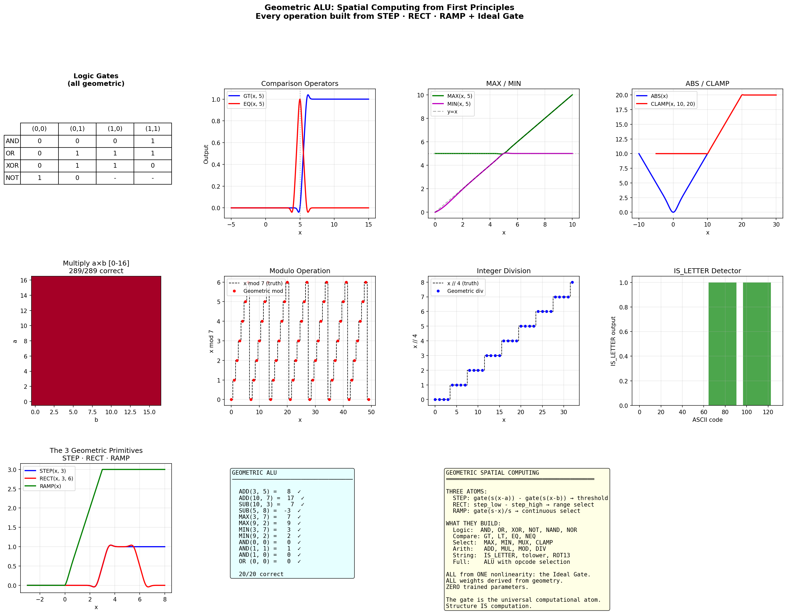
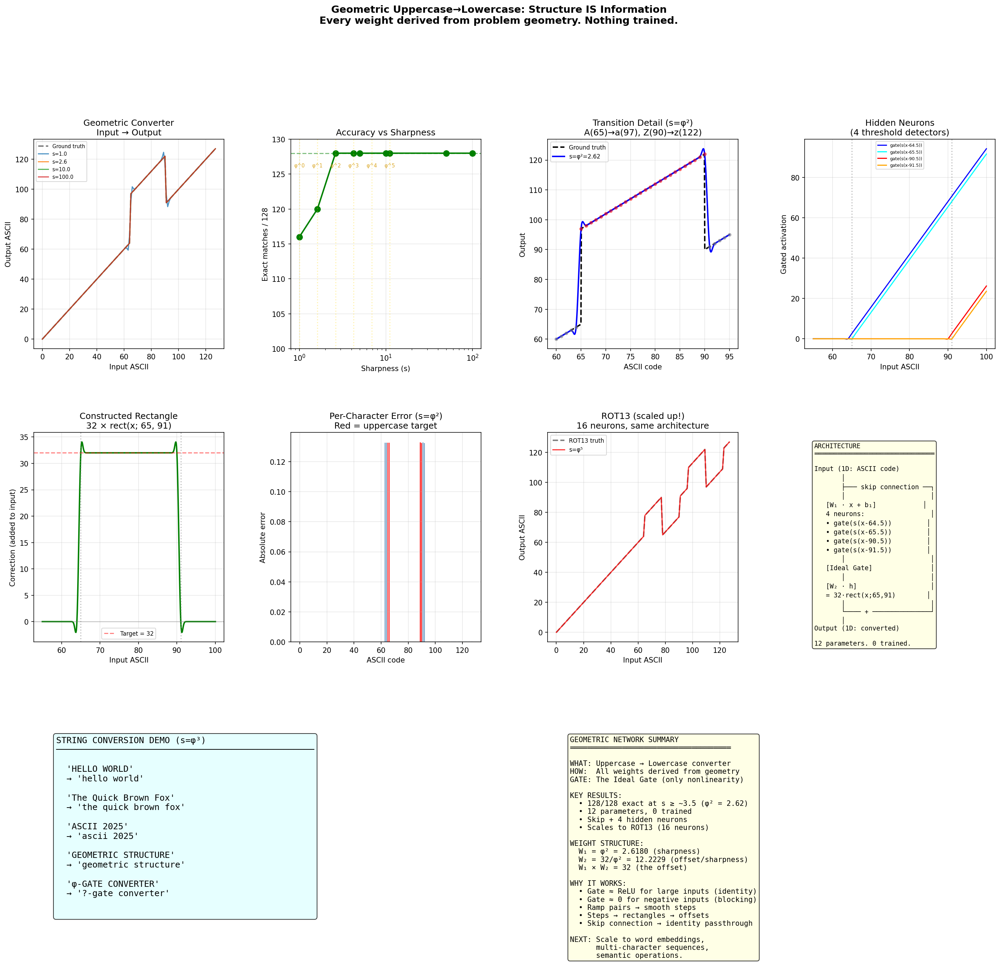

# φ-Rules: Geometric Computation Framework

**Replace learned AI behaviors with geometric primitives.**

> ```
> EN:  The bright light shone right there in the night.
> IPA: θɛ bɹaɪt laɪt ʃoʊn ɹaɪt θɛɹ ɪn θɛ naɪt.
>
> EN:  Some love to dance but none have a choice in the voice.
> IPA: sʌm lʌv tɒ dæns bʌt nʌn hæv æ ʧɒɪs ɪn θɛ vɒɪs.
>
> EN:  I hope to make a fine cake and ride home in time.
> IPA: ɪ hoʊp tɒ meɪk æ faɪn keɪk ænd ɹaɪd hoʊm ɪn taɪm.
>
> EN:  I think the prince sat on the fence and drank his drink.
> IPA: ɪ θɪŋk θɛ pɹɪns sæt ɒn θɛ fɛns ænd dɹæŋk hɪs dɹɪŋk.
> ```
> *29 rules. 159 geometric primitives. No neural network. No training.*
> *Structure IS the computation.*

φ-Rules is a framework for discovering and applying transformation rules using φ-geometric gate functions instead of neural networks. Given input-output examples, the system automatically detects which features matter, discovers context-dependent selectors via information gain, and composes rules through a multi-phase pipeline — all using the mathematics of the golden ratio.

---

## The Geometric Primitives

Everything in φ-Rules is built from **three atoms** — STEP, RECT, and RAMP — all derived from a single nonlinearity: the Ideal Gate.


<sub>Generated by <code>geometric_alu.py</code> — run it yourself to reproduce</sub>

From these three primitives, we construct: logic gates (AND, OR, XOR, NOT), comparison operators, MAX/MIN, ABS/CLAMP, integer multiplication (289/289 correct), modulo, division, and letter detection — a complete **geometric ALU** with zero trained parameters.

### String Transforms: Structure IS Information

The same primitives that build an ALU also build string transformations. Here's uppercase → lowercase conversion, where every weight is derived from the problem geometry — nothing trained:


<sub>Generated by <code>geometric_uppercase.py</code> — run it yourself to reproduce</sub>

The key insight visible in these charts:

- **Top-left**: The geometric converter learns a piecewise-linear function that maps A-Z (65-90) down by 32 to a-z (97-122) while leaving everything else unchanged
- **Middle-left**: A single RECT pair (width 26, height 32) does the job — it activates precisely in the uppercase range
- **Bottom-left**: The 3 geometric primitives (STEP, RECT, RAMP) that build everything
- **Top-right**: 4 hidden neurons, each a threshold detector at a different boundary, combine to form the RECT

The tolower conversion needs **12 parameters and 4 hidden neurons**. The IPA conversion uses the same architecture scaled up to **159 gate_step calls across 29 rules** — same math, more rules, automatically discovered.

---

## How Rules Are Learned

### 1. The Gate Function

Every rule is built from a single primitive — the **RECT pair**:

```
gate_step(x, target, φ²) = [ideal_gate(φ²·(x - target + 0.5)) - ideal_gate(φ²·(x - target - 0.5))] / φ²
```

Where the ideal gate is:

```
ideal_gate(x) = x · σ(√(8/π) · x · (1 + (4-π)/(6π) · x²))
```

This is a width-1 pulse centered at `target` with sharpness φ² (the square of the golden ratio). At integer resolution, it becomes an exact indicator function — selecting precisely one input value and mapping it to a new output.

A character substitution like `a → æ` is simply:

```python
output = input + height × gate_step(input, ord('a'), φ²)
```

Rules compose **additively** — stacking RECT pairs builds arbitrary piecewise transformations.

### 2. Automatic Feature Detection

When the same input produces different outputs depending on context (like English 'c' → /k/ before 'a' but → /s/ before 'e'), the framework **automatically discovers** which context variable explains the variation.

The algorithm uses **information gain** (entropy reduction) to rank candidate context variables:

```
H(output) - H(output | context_variable) = information gain
```

The variable with the highest gain IS the selector. No search over architectures, no hyperparameter tuning — the geometry of the data reveals the rule.

### 3. The Gear-Shift Mechanism

Some rules need multi-level context. English 'g' before 'i' can be either hard (gift) or soft (gin) — a single context variable isn't enough.

The gear-shift solves this with a two-level selector:

- **Coarse gear**: The simplest variable that resolves the most cases (e.g., `next_char` distinguishes hard-g before 'a,o,u' from soft-g before 'e,y')
- **Fine gear**: For ambiguous teeth on the coarse gear, a secondary variable engages (e.g., when `next_char='i'`, check `next_next_char` to distinguish gift from gin)

This is discovered automatically from examples — 24 training pairs for the full g-rule, including exceptions.

---

## The Four-Phase Pipeline

Rules compose through a pipeline that mirrors how information flows from coarse structure to fine detail:

```
Input
  │
  ▼
Phase 0: FEATURE EXTRACTION
  │  Non-local pattern detection (scan-ahead features)
  │  Discovers patterns that span multiple positions
  │
  ▼
Phase 1: STRUCTURAL COLLAPSE
  │  Multi-element patterns merge into single units
  │  Reduces dimensionality before element-wise processing
  │
  ▼
Phase 2: CONTEXT CHANNELS
  │  Auto-detected gear-shift selectors
  │  Each channel is a RECT × SELECTOR product
  │
  ▼
Phase 3: ELEMENT RECTS
  │  Simple 1:1 substitutions (additive RECT pairs)
  │
  ▼
Output
```

This architecture wasn't designed top-down — it was **discovered** by asking what minimal structure handles increasingly complex transformations. The same four phases appear independently in text processing and pixel transforms (documented in our cross-domain experiments).

---

## The IPA Demonstration

The included demo applies the framework to English-to-IPA (International Phonetic Alphabet) transcription — a task that typically requires either hand-crafted rule engines or trained sequence-to-sequence models.

### What the demo discovers from examples

| Phase | What | How many | Method |
|-------|------|----------|--------|
| 0 | Magic-e, igh trigraph, silent final e | 5 trained vowel rules (4 geared) | Scan-ahead feature extraction |
| 1 | sh→ʃ, th→θ, ng→ŋ, ch→ʧ, ee→iː, etc. | 13 patterns (4 frozen) | Structural collapse |
| 2 | c→k/s, g→g/j, y→j/i | 3 rules (1 two-level gear) | Auto feature detection |
| 3 | a→æ, e→ɛ, i→ɪ, o→ɒ, u→ʌ, j→ʒ, r→ɹ | 7 substitutions | Additive RECT pairs |

The demo runs as **24 progressive lessons** — each one teaches an IPA concept while the explanation text itself transforms as rules accumulate, so you can watch the geometric program grow in real-time.

---

## Quick Start

```bash
git clone https://github.com/lostdemeter/phi_rules.git
cd phi_rules
pip install -r requirements.txt
```

### Run the progressive lesson demo

```bash
python ipa_demo.py
```

### Interactive mode — type English, get IPA

```bash
python ipa_demo.py --interactive
```

### Run the test suite

```bash
python ipa_demo.py --test
```

### Run the auto-context detection tests standalone

```bash
python auto_context_detection.py
```

---

## The Math

### Why φ?

The golden ratio φ = (1+√5)/2 ≈ 1.618 appears throughout this framework because it sits at a **phase transition boundary** in gate function behavior:

- Gate sharpness below ~1.5: too soft, rules bleed into neighbors
- Gate sharpness above ~1.6: sharp enough for exact discrimination
- **φ² ≈ 2.618** is the natural sharpness for width-1 RECT pairs

This connects to a deeper finding: GELU (the dominant activation in modern LLMs) has curvature √(2/π) at the origin. The φ-scaled sigmoid `x·σ(φ·x)` has curvature φ/2. These match within 1.38% — the golden ratio is the **geometric skeleton** of the neural network's nonlinearity.

### The ideal_gate function

```python
S8P = √(8/π)       # ≈ 1.5958 ≈ φ (within 1.38%)
CGE = (4-π)/(6π)    # cubic correction coefficient

def ideal_gate(x):
    f = S8P * x * (1 + CGE * x²)
    return x * σ(f)
```

This is the GELU approximation expressed in terms of fundamental constants (π and the Gaussian error function's Taylor expansion). The cubic correction barely matters for computation — what matters is the **curvature at zero**, which determines the gate's discrimination sharpness.

### Information gain as geometric dimension

When the auto-detection system computes information gain for each context variable, it's performing **PCA on categorical data**:

- Each context variable defines a partition of the observation space
- Information gain = variance explained by that partition
- The variable with highest gain is the principal component of the context

The gear-shift extends this to hierarchical PCA — coarse gear captures the first principal component, fine gear captures residual variance within ambiguous partitions.

---

## Project Structure

```
phi_rules/
├── README.md
├── LICENSE
├── requirements.txt
├── .gitignore
├── ipa_demo.py                     # IPA demonstration (24 lessons + interactive mode)
├── auto_context_detection.py       # Core framework: context detection, gear-shift, rule building
├── geometric_alu.py                # Generates images/geometric_alu.png (requires torch + matplotlib)
├── geometric_uppercase.py          # Generates images/geometric_uppercase.png (requires torch + matplotlib)
└── images/
    ├── geometric_alu.png           # Geometric ALU visualization
    └── geometric_uppercase.png     # String conversion visualization
```

## Requirements

```
numpy
```

That's it. No torch, no tensorflow, no model downloads. The core framework runs on NumPy and Python's standard library.

The visualization scripts (`geometric_alu.py`, `geometric_uppercase.py`) additionally require `torch` and `matplotlib` to regenerate the images.

---

## How This Connects

φ-Rules is part of the [TruthSpace Geometric LCM](https://github.com/lostdemeter/truthspace-lcm) project, which investigates the hypothesis that **LLMs are hyperdimensional transcoders** — they encode information into geometric structure and decode it back out.

Other standalone demonstrations from the project:

- **[phi-depth](https://github.com/lostdemeter/phi-depth)**: Real-time depth estimation using φ-arithmetic (125 bytes of weights replace a neural decoder)
- **[geometric-colorizer](https://github.com/lostdemeter/geometric-colorizer)**: Image colorization where GELU → φ-soft gate and a 9-layer transformer → single matrix multiply

Each project proves the same thesis from a different angle: the intelligence is in the **shape**, not the weights.

---

## License

GPL-3.0 — see [LICENSE](LICENSE).
